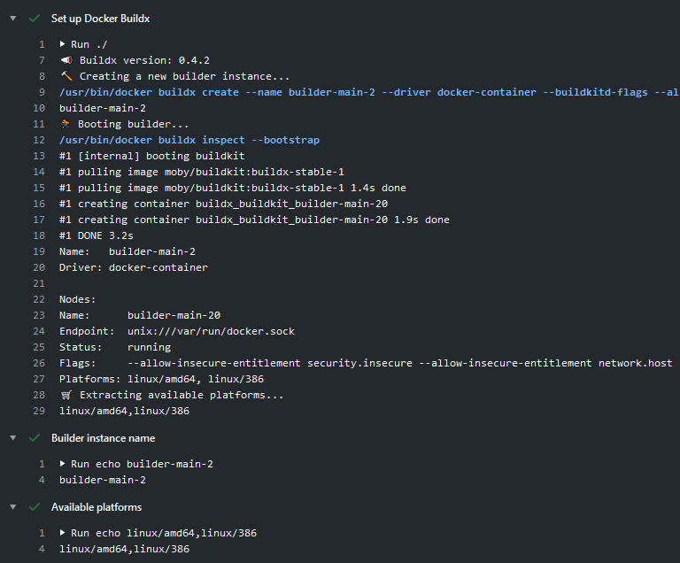

[](https://github.com/docker/setup-buildx-action/releases/latest)
[](https://github.com/marketplace/actions/docker-setup-buildx)
[](https://github.com/docker/setup-buildx-action/actions?workflow=ci)
[](https://github.com/docker/setup-buildx-action/actions?workflow=test)
[](https://codecov.io/gh/docker/setup-buildx-action)

## About

GitHub Action to set up Docker [Buildx](https://github.com/docker/buildx).

This action will create and boot a builder that can be used in the following
steps of your workflow if you're using Buildx or the [`build-push` action](https://github.com/docker/build-push-action/).
By default, the [`docker-container` driver](https://docs.docker.com/build/building/drivers/docker-container/)
will be used to be able to build multi-platform images and export cache using
a [BuildKit](https://github.com/moby/buildkit) container.



___

* [Usage](#usage)
* [Configuring your builder](#configuring-your-builder)
* [Customizing](#customizing)
  * [inputs](#inputs)
  * [outputs](#outputs)
  * [environment variables](#environment-variables)
* [Notes](#notes)
  * [`nodes` output](#nodes-output)
* [Contributing](#contributing)

## Usage

```yaml
name: ci

on:
  push:

jobs:
  buildx:
    runs-on: ubuntu-latest
    steps:
      -
        name: Checkout
        uses: actions/checkout@v4
      -
        # Add support for more platforms with QEMU (optional)
        # https://github.com/docker/setup-qemu-action
        name: Set up QEMU
        uses: docker/setup-qemu-action@v3
      -
        name: Set up Docker Buildx
        uses: docker/setup-buildx-action@v3
```

## Configuring your builder

* [Version pinning](https://docs.docker.com/build/ci/github-actions/configure-builder/#version-pinning): Pin to a specific Buildx or BuildKit version
* [BuildKit container logs](https://docs.docker.com/build/ci/github-actions/configure-builder/#buildkit-container-logs): Enable BuildKit container logs for debugging purposes
* [BuildKit Daemon configuration](https://docs.docker.com/build/ci/github-actions/configure-builder/#buildkit-daemon-configuration)
  * [Registry mirror](https://docs.docker.com/build/ci/github-actions/configure-builder/#registry-mirror): Configure a registry mirror for your builds
  * [Max parallelism](https://docs.docker.com/build/ci/github-actions/configure-builder/#max-parallelism): Configure the maximum parallelism for your builds
* [Append additional nodes to the builder](https://docs.docker.com/build/ci/github-actions/configure-builder/#append-additional-nodes-to-the-builder): Create additional nodes for your builder
* [Authentication for remote builders](https://docs.docker.com/build/ci/github-actions/configure-builder/#authentication-for-remote-builders)
  * [SSH authentication](https://docs.docker.com/build/ci/github-actions/configure-builder/#ssh-authentication): Authenticate to a remote builder using SSH
  * [TLS authentication](https://docs.docker.com/build/ci/github-actions/configure-builder/#tls-authentication): Authenticate to a remote builder using TLS
* [Standalone mode](https://docs.docker.com/build/ci/github-actions/configure-builder/#standalone-mode): Use Buildx as a standalone binary (without the Docker CLI)
* [Isolated builders](https://docs.docker.com/build/ci/github-actions/configure-builder/#isolated-builders): Create isolated builders for your builds

## Customizing

### inputs

The following inputs can be used as `step.with` keys:

> `List` type is a newline-delimited string
> ```yaml
> driver-opts: |
>   image=moby/buildkit:master
>   network=host
> ```

> `CSV` type must be a comma-delimited string
> ```yaml
> platforms: linux/amd64,linux/arm64
> ```

| Name                         | Type     | Default            | Description                                                                                                                                                                  |
|------------------------------|----------|--------------------|------------------------------------------------------------------------------------------------------------------------------------------------------------------------------|
| `version`                    | String   |                    | [Buildx](https://github.com/docker/buildx) version. (eg. `v0.3.0`, `latest`, `https://github.com/docker/buildx.git#master`)                                                  |
| `driver`                     | String   | `docker-container` | Sets the [builder driver](https://docs.docker.com/engine/reference/commandline/buildx_create/#driver) to be used                                                             |
| `driver-opts`                | List     |                    | List of additional [driver-specific options](https://docs.docker.com/engine/reference/commandline/buildx_create/#driver-opt) (eg. `image=moby/buildkit:master`)              |
| `buildkitd-flags`            | String   |                    | [BuildKit daemon flags](https://docs.docker.com/engine/reference/commandline/buildx_create/#buildkitd-flags)                                                                 |
| `buildkitd-config` \*        | String   |                    | [BuildKit daemon config file](https://docs.docker.com/engine/reference/commandline/buildx_create/#config)                                                                    |
| `buildkitd-config-inline` \* | String   |                    | Same as `buildkitd-config` but inline                                                                                                                                        |
| `install`                    | Bool     | `false`            | Sets up `docker build` command as an alias to `docker buildx`                                                                                                                |
| `use`                        | Bool     | `true`             | Switch to this builder instance                                                                                                                                              |
| `endpoint`                   | String   |                    | [Optional address for docker socket](https://docs.docker.com/engine/reference/commandline/buildx_create/#description) or context from `docker context ls`                    |
| `platforms`                  | List/CSV |                    | Fixed [platforms](https://docs.docker.com/engine/reference/commandline/buildx_create/#platform) for current node. If not empty, values take priority over the detected ones. |
| `append`                     | YAML     |                    | [Append additional nodes](https://docs.docker.com/build/ci/github-actions/configure-builder/#append-additional-nodes-to-the-builder) to the builder                          |
| `cache-binary`               | Bool     | `true`             | Cache buildx binary to GitHub Actions cache backend                                                                                                                          |
| `cleanup`                    | Bool     | `true`             | Cleanup temp files and remove builder at the end of a job                                                                                                                    |

> [!IMPORTANT]
> If you set the `buildkitd-flags` input, the default flags (`--allow-insecure-entitlement security.insecure --allow-insecure-entitlement network.host`)
> will be reset. If you want to retain the default behavior, make sure to
> include these flags in your custom `buildkitd-flags` value.

> [!NOTE]
> `buildkitd-config` and `buildkitd-config-inline` are mutually exclusive.

### outputs

The following outputs are available:

| Name        | Type   | Description                                         |
|-------------|--------|-----------------------------------------------------|
| `name`      | String | Builder name                                        |
| `driver`    | String | Builder driver                                      |
| `platforms` | String | Builder node platforms (preferred and/or available) |
| `nodes`     | JSON   | Builder [nodes metadata](#nodes-output)             |

### environment variables

The following [official docker environment variables](https://docs.docker.com/engine/reference/commandline/cli/#environment-variables) are supported:

| Name            | Type   | Default     | Description                                     |
|-----------------|--------|-------------|-------------------------------------------------|
| `DOCKER_CONFIG` | String | `~/.docker` | The location of your client configuration files |

## Notes

### `nodes` output

```json
[
  {
     "name": "builder-3820d274-502c-4498-ae24-d4c32b3023d90",
     "endpoint": "unix:///var/run/docker.sock",
     "driver-opts": [
       "network=host",
       "image=moby/buildkit:master"
     ],
    "status": "running",
    "buildkitd-flags": "--allow-insecure-entitlement security.insecure --allow-insecure-entitlement network.host",
    "buildkit": "3fab389",
    "platforms": "linux/amd64,linux/amd64/v2,linux/amd64/v3,linux/amd64/v4,linux/386"
  }
]
```

| Name              | Type   | Description                |
|-------------------|--------|----------------------------|
| `name`            | String | Node name                  |
| `endpoint`        | String | Node endpoint              |
| `driver-opts`     | List   | Options for the driver     |
| `status`          | String | Node status                |
| `buildkitd-flags` | String | Flags for buildkitd daemon |
| `buildkit`        | String | BuildKit version           |
| `platforms`       | String | Platforms available        |

## Contributing

Want to contribute? Awesome! You can find information about contributing to
this project in the [CONTRIBUTING.md](/.github/CONTRIBUTING.md)
